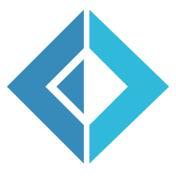

I'm a hobbyist programmer and (very) occasionally game developer.

My main area of interest is currently compilers and programming language development. Also interested in functional programming. Ask me what a monad is, I might have a reasonable answer.

Currently working on various programming language development-related things, as well as miscellaneous side-projects whenever I feel like it.

Main languages are  and sometimes  if I'm feeling adventureous. Also learning  as a side.

---

 

