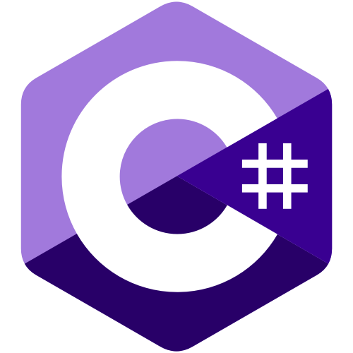
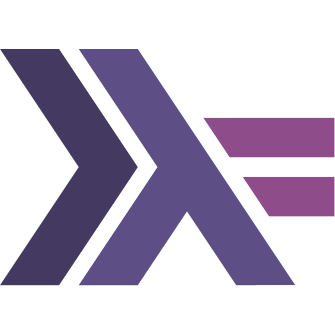

I'm a hobbyist programmer and occasionally game developer.

My main area of interest is currently compilers and programming language development.

Main languages are  and sometimes  if I'm feeling adventureous.

---

 

---

 

Currently working on a weird esoteric programming language.

